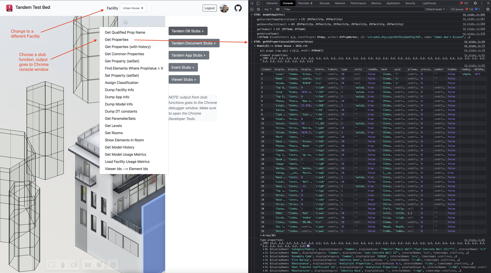

# Tandem Viewer TestBed

## Overview

This sample is a test bed application for exercising the Tandem Viewer in an embedded viewer scenario.

It is designed to bring in as few dependencies as possible.  It is plain Javascript and HTML with the exception of jQuery and Bootstrap just to do minimal styling.  The app is designed as simple "Stubs" of functionality that for the most part just dump out results to the Chrome console window.  These interactive tests will surface useful information that you can then use in some of your other code (e.g., URNs for Facilities, Models, etc.). In cases where input is required from the user, the UI is as minimal as possible, or you are expected to change the code itself that supplies that input, or put a breakpoint in the debugger and change the value temporarily.

*NOTE: The Javascript SDK that supports the Embedded Viewer is not yet official. It is an ALPHA version for early preview. This app is not a complete description of the API and is evolving over time as the API evolves.  Any use of this API should be for prototype purposes only.*

## Live Demo

If you just want to run the application without modifying source code, please visit: https://autodesk-tandem.github.io/tandem-sample-emb-viewer/

Login with your Autodesk ID and then choose one of the Facilities you have access to.  If you have not setup any Facilities yet, please use the Tandem application to do so: https://tandem.autodesk.com

## Running Locally

If you would like to use the source to debug or extend with your own test stub functions, follow these steps:

1. Install npm: https://www.npmjs.com
2. Make sure you have an account and access to at least one facility at https://tandem.autodesk.com (PRODUCTION environment) or https://tandem-stg.autodesk.com (STAGING environment).
3. Create a new Application on the Forge Developer Portal to get your Client_ID: https://forge.autodesk.com

## Setup and Configuration

1. After cloning this repo, run `npm install`.
2. Add your application Client_ID to the code.  Find the appropriate lines in the file `env.js` as shown in the image below.

3. Make sure to use the appropriate environment consistently.  Depending on whether you are using STAGING or PRODUCTION (as shown in the image above), set the Viewer to load into the HTML page using the same environment.

## Start App

To start the development server, run `npm start`. The browser should open for you at http://localhost:8080 and take you to the login first, and then back to your app.

*NOTE: token refresh doesn't always work.  If you reload the app and find it in an infinite refresh loop, delete the token as shown in the image below. (this will be fixed at a later date)*

## Using the App

